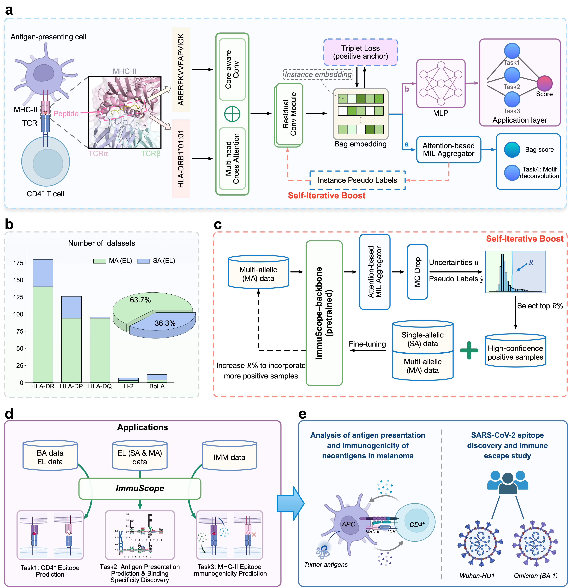

## ImmuScope: Unified framework utilizing self-iterative multiple instance learning for predicting CD4+ T cell immunogenic epitope

This repository contains the source code for the paper **Unified framework utilizing self-iterative multiple instance
learning for predicting CD4+ T cell immunogenic epitope**.



ImmuScope, a **unified deep-learning framework** tailored for large-scale immunopeptidomics datasets, combining
**self-iterative multiple-instance learning (MIL)** and **triplet loss** to improve predictions of MHC-II antigen
presentation, CD4+ T cell epitopes, and their immunogenicity.

### Installation

1. Clone the repository.

   ```bash
   git clone https://github.com/shenlongchen/ImmuScope.git
   ```
2. Create a virtual environment by conda.

   ```bash
   conda create -n ImmuScope_env python=3.9.19
   conda activate ImmuScope_env
   ```
3. Download PyTorch>=1.12.1, which is compatible with your CUDA version and other Python packages.

   ```bash
   conda install pytorch==1.12.1 torchvision==0.13.1 torchaudio==0.12.1 cudatoolkit=11.6 -c pytorch -c conda-forge
   pip install -r requirements.txt
   ```

### Data and model weights

The following data and model weights are available at [Zenodo](https://zenodo.org/records/14184202).

- `data/raw`: Raw data related to antigen presentation and CD4+ T cell epitopes: binding affinity data, EL
  data, CD4+ T cell epitope benchmarking test data, MHC-II allele list, supported MHC-II pseudo sequences.
- `data/el_datasets`: single- and multi- allelic antigen presentation training data applied
  to ImmuScope input.
- `data/cd4_datasets`: binding affinity training data and CD4+ T cell epitope benchmarking test data applied to
  ImmuScope input.
- `data/im_datasets`: Immunogenicity training and testing data applied to ImmuScope input and raw data.

- `weights/EL`: model weights for predicting antigen presentation & binding specificity discovery & MA data
  binding motif deconvolution.
- `weights/CD4`: model weights for predicting CD4+ T cell epitope.
- `weights/IM`: model weights for predicting MHC-II epitope immunogenicity.

### Usage

#### 1. Antigen presentation prediction

- 5CV for antigen presentation prediction.

  ```bash
  python main_antigen_presentation_5cv.py --data-cnf configs/data.yaml --model-cnf configs/ImmuScope-EL.yaml
  ```
- Train antigen presentation prediction model based on (SA and MA) eluted ligand data.

  ```bash
  python main_antigen_presentation_train.py --data-cnf configs/data.yaml --model-cnf configs/ImmuScope-EL.yaml
  ```

#### 2. CD4+ T cell epitope prediction

- Train CD4+ T cell epitope prediction model based on antigen presentation prediction model.

  ```bash
  python main_cd4_epitope_train.py --data-cnf configs/data.yaml --model-cnf configs/ImmuScope.yaml
  ```

- Test CD4+ T cell epitope prediction model on benchmarking test data.

  ```bash
  python main_cd4_epitope_test.py --data-cnf configs/data.yaml --model-cnf configs/ImmuScope.yaml                                 
  ```

#### 3. Immunogenicity prediction

- Train immunogenicity prediction model with immunogenicity data.

  ```bash
  python main_immunogenicity_train.py --data-cnf configs/data.yaml --model-cnf configs/ImmuScope-IM.yaml
  ```
- Test immunogenicity prediction model on immunogenicity data.

  ```bash
  python main_immunogenicity_test.py --data-cnf configs/data.yaml --model-cnf configs/ImmuScope-IM.yaml
  ```

### Citation

```tex

Long-Chen Shen, Yumeng Zhang, Zhikang Wang, Yan Liu, Jinghui Tang, Jiangning Song, and Dong-Jun Yu. Unified framework utilizing self-iterative multiple instance learning for predicting CD4+ T cell immunogenic epitope

```

### Contact

If you have any questions, please contact us
at [shenlc1995@njust.edu.cn](mailto:shenlc1995@njust.edu.cn), [jiangning.song@monash.edu](mailto:jiangning.song@monash.edu)
or [njyudj@njust.edu.cn](mailto:njyudj@njust.edu.cn).
